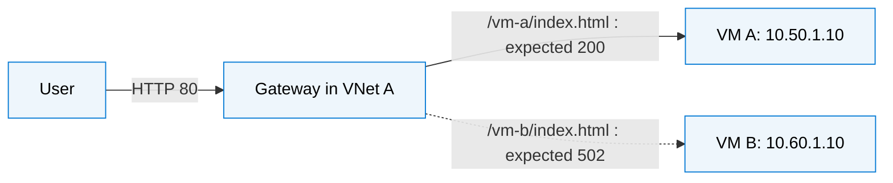

> Phase 2: see [PEERING.md](PEERING.md). The baseline below applies with enable_peering=false in both projects. The VM-to-VM test is not a phase-2 acceptance check because of the NSG restriction.

# Project B — Isolated remote VM

# Phase 1: reproduce cross-VNet gateway failure

Two independent Terraform root projects, each with its own resource group, VNet, private Windows Server 2022 VM, IIS test page and state. Based on azure-win-vm-lab (AzureRM 4.47.0, Standard_B2as_v2). No existing state, credentials, or resources are reused.

| Component | Project A | Project B |
|---|---|---|
| Folder | azure-gateway-lab-a | azure-gateway-lab-b |
| Resource group | gateway-lab-a-rg | gateway-lab-b-rg |
| VNet | 10.50.0.0/16 | 10.60.0.0/16 |
| VM subnet | 10.50.1.0/24 | 10.60.1.0/24 |
| VM address | 10.50.1.10 | 10.60.1.10 |
| Application Gateway subnet | 10.50.0.0/24 | None |
| Gateway | Standard_v2, 1 instance | None |
| IIS page | VM A | VM B |



Resource groups are management boundaries, NOT the cause of network isolation. The intended fault is two disconnected VNets. Both backend pools, listener, path routing, IIS pages, probes and HTTP permissions exist. There is deliberately no VNet connectivity resource or repair script. Phase 2 will be done only on request.

Each VM has only a private NIC address. Its NAT Gateway/public IP provides outbound access for Azure VM extensions, Windows activation and updates; it does not expose inbound HTTP/RDP. Project A additionally has the public Application Gateway IP. NAT does not connect the two VNets. The VM NSG permits HTTP from 10.50.0.0/24 then denies other inbound traffic; Azure platform agent access remains available.

## Before you deploy manually

No init, plan or apply is needed to read these projects. No Azure resources have been deployed as part of project generation. They have independent local states; run commands from the appropriate folder. Configure the same subscription/tenant/region in both. No remote-state dependency is required. If you change VM B's static address, update remote_vm_private_ip in A.

Copy terraform.tfvars.example to terraform.tfvars and fill the IDs. Do not copy the old project's state or saved plans. Supply a strong password outside source control:

```powershell
$secure = Read-Host 'Windows administrator password' -AsSecureString
$env:TF_VAR_admin_password = [Net.NetworkCredential]::new('', $secure).Password
```

Terraform state and saved plans can contain this password; protect them and never commit them. There is no public RDP access. Azure Portal VM Run Command is the intended management/inspection path (requires permissions and a healthy VM agent).

Deploy project B first, then A, when you decide to run Terraform. Do not expect VM B to work through the gateway in phase 1. Keep both VMs running during diagnosis.

## Observe the fault after a future deployment

1. Confirm the install-iis extension succeeded on BOTH VMs.
2. In each VM's Azure Portal > Run command > RunPowerShellScript, run:
   `(Invoke-WebRequest -UseBasicParsing http://localhost/health.txt).StatusCode`
   Expected: 200 on both VMs. This distinguishes the intended network fault from a failed web-server installation.
3. Use project A's local_vm_url output: expected 200 with the VM A page.
4. Use project A's remote_vm_url output: expected 502.
5. Inspect Application Gateway > Backend health: vm-a healthy, vm-b unhealthy after probe convergence. CLI equivalent:
   `az network application-gateway show-backend-health --resource-group gateway-lab-a-rg --name gateway-lab-a-gateway`
6. To confirm the missing TCP path, use VM A Run Command:
   `Test-NetConnection 10.60.1.10 -Port 80`
   Expected: TcpTestSucceeded=False.

The probe sends an HTTP Host header of 127.0.0.1 to the backend IP, requesting /health.txt. IIS has its default wildcard HTTP binding. This does not probe the gateway's localhost.

If both pools are unhealthy, first check IIS installation, VM power/agent status and the local HTTP test. That is not the intended reproduction. No live reproduction claim is made until both environments are deployed and checked.

## Subscription and cost

Defaults: Denmark East and Standard_B2as_v2 (2 vCPU/8 GiB each), 4 total VM vCPUs. Previously successful choices are not a capacity guarantee. Verify allowed regions, total/family VM quotas, VM SKU availability, Microsoft.Network/Microsoft.Compute registration, and gateway/public-IP/NAT quotas before deployment.

Billable components include two Windows VMs/disks, two NAT Gateways with two public IPs, and one Application Gateway with its public IP. Gateway uses Standard_v2, one instance, HTTP only: a deliberate connectivity lab, not production HA/WAF/TLS. Deallocating VMs does not stop gateway, NAT or disk charges. Delete both lab resource groups through their own Terraform projects when finished; never reuse state from another lab.

## References

- https://learn.microsoft.com/en-us/azure/application-gateway/application-gateway-components
- https://learn.microsoft.com/en-us/azure/nat-gateway/nat-gateway-design
